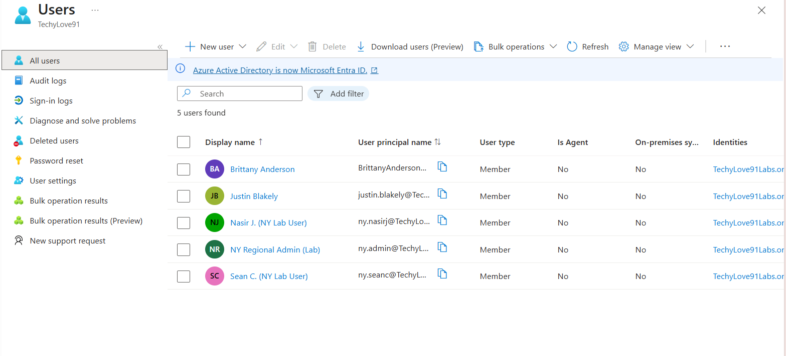
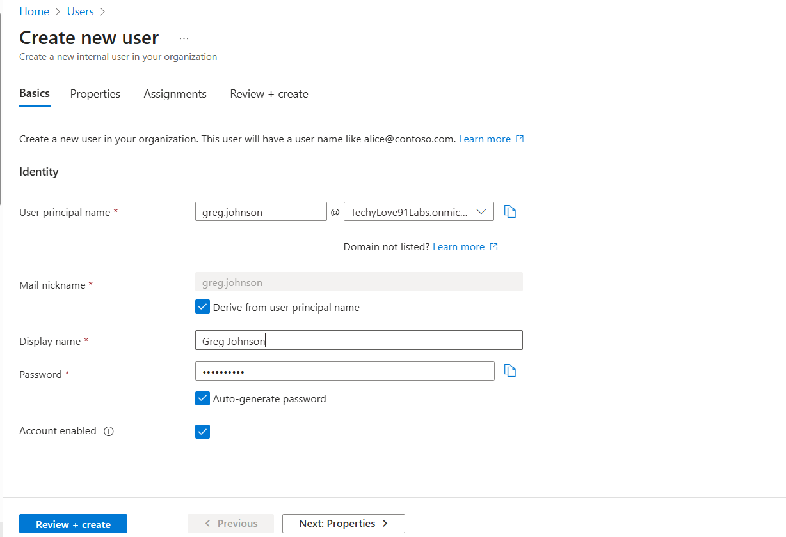
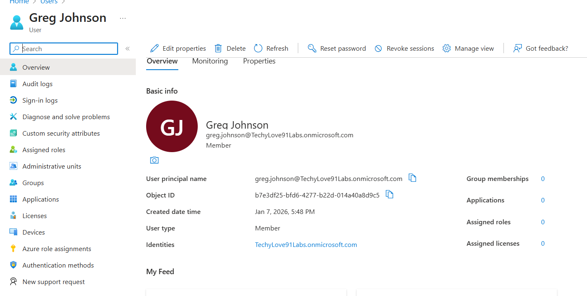
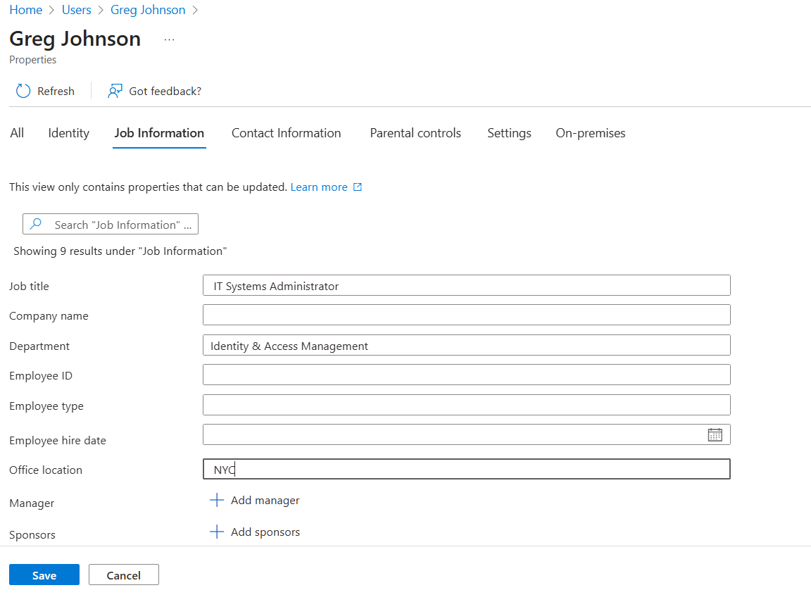
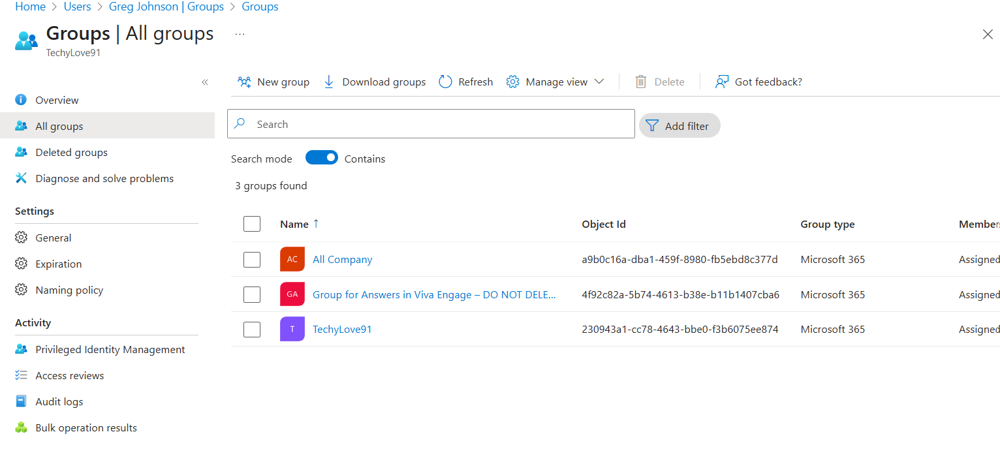
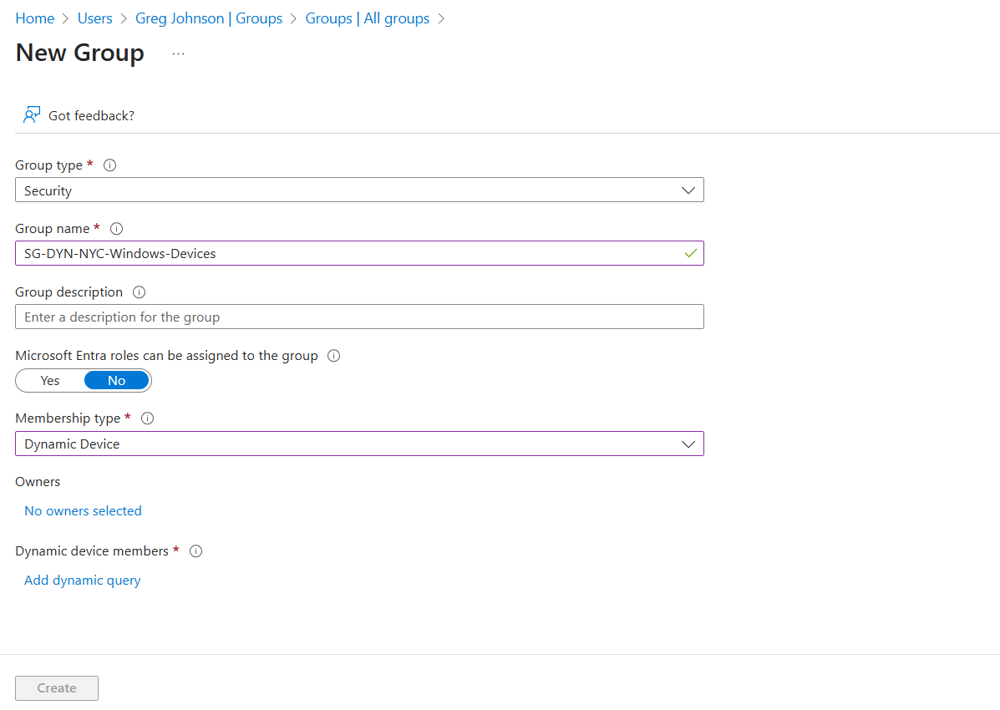
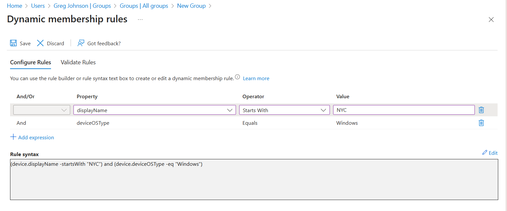
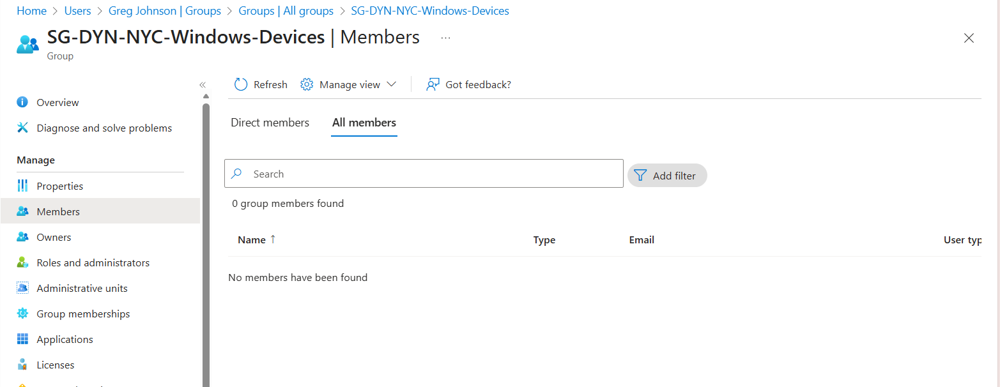

# Lab 03 — Entra ID User Properties & Dynamic Device Group (NYC Windows)

## Overview
This lab demonstrates hands-on experience with Microsoft Entra ID user administration and dynamic device-based group management. The scenario focused on creating a new user, updating identity attributes, and configuring a dynamic security group for Windows devices using naming conventions.

---

## Scenario 1 — Entra ID User Administration

In this scenario, a new user (Greg Johnson) was created in Microsoft Entra ID and core identity attributes were updated to support directory hygiene and identity-driven access management.

### User Creation

The user account for Greg Johnson was created in the Entra admin center with standard account settings.

---

### Updating Identity Attributes

After account creation, the following attributes were configured:
- Job Title  
- Department  
- Office Location  

These attributes are commonly used for access scoping, automation, and identity governance.

---

## Scenario 2 — Dynamic Device Security Group

In this scenario, a dynamic security group was created to automatically include Windows devices whose names begin with "NYC". This approach supports scalable access control and device-based policy targeting.

### Group Creation

A new Security group was created with Dynamic Device membership.

---

### Dynamic Membership Rule

A dynamic rule was configured to scope membership based on:
- Device operating system = Windows  
- Device display name starts with "NYC"  

This ensures only qualifying NYC-based Windows devices are included.

---

### Membership Validation

After group creation, membership was validated to confirm correct device inclusion based on the rule logic.

---

## Skills Demonstrated
- Microsoft Entra ID user lifecycle management  
- Identity attribute configuration and directory hygiene  
- Dynamic group rule logic  
- Device-based access scoping  
- Understanding of identity-driven access control concepts  

---

## Why This Matters
Identity is a core security boundary in modern environments. This lab demonstrates foundational IAM skills that directly support:
- Conditional Access policies  
- Application assignment and access control  
- Zero Trust architecture  
- Device compliance enforcement  
- Scalable identity governance
