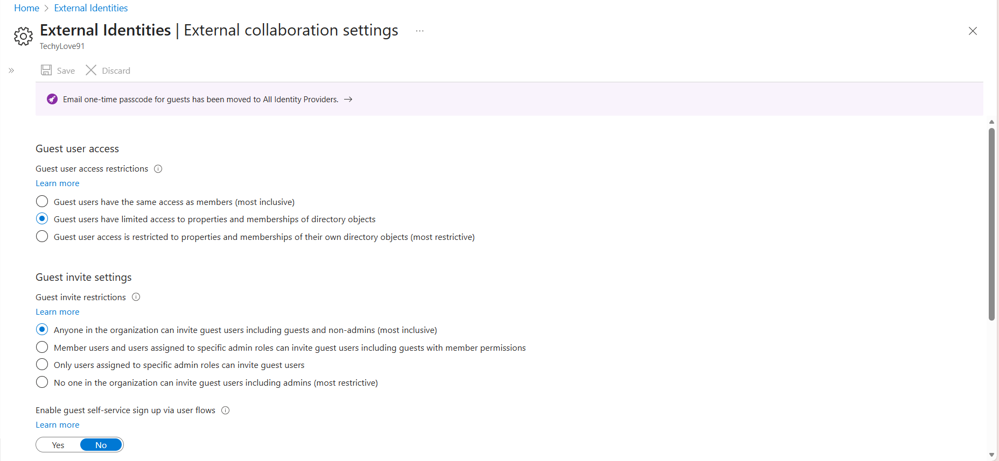
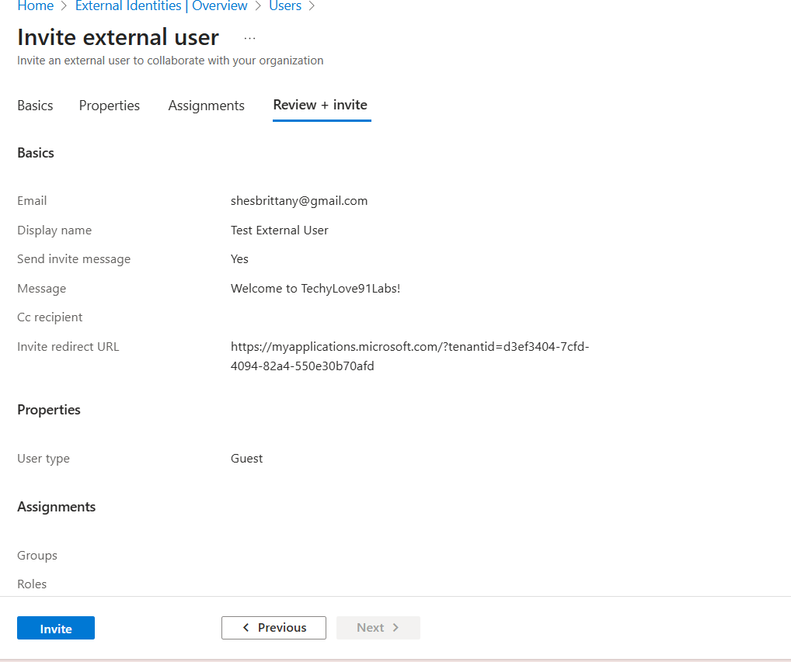
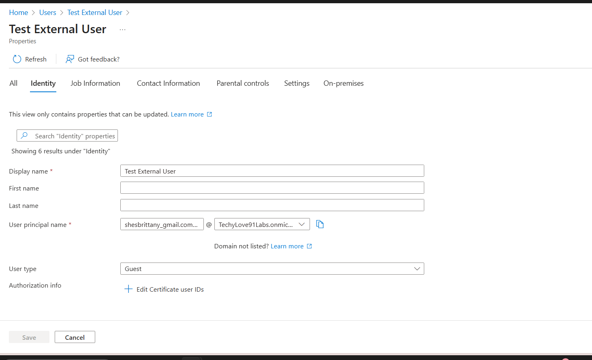
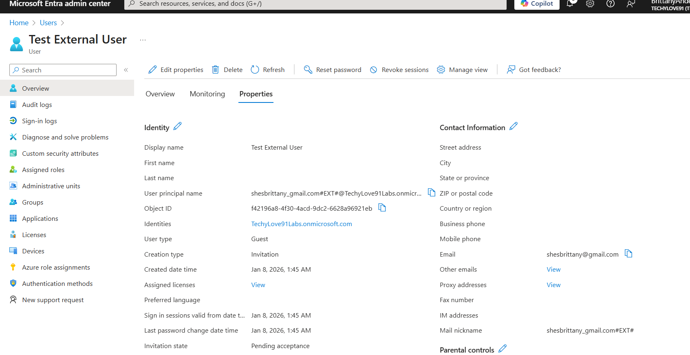
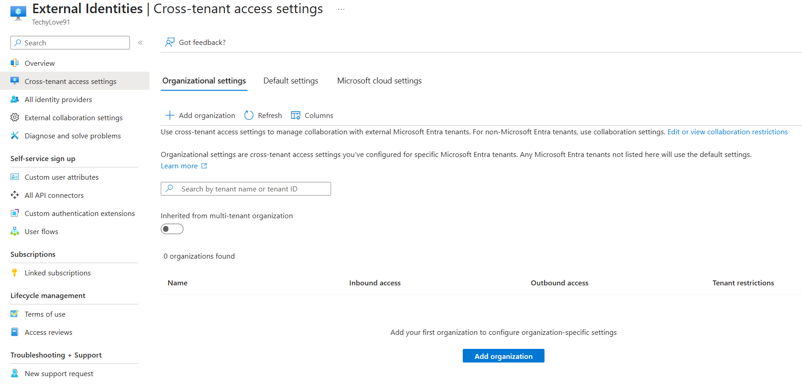
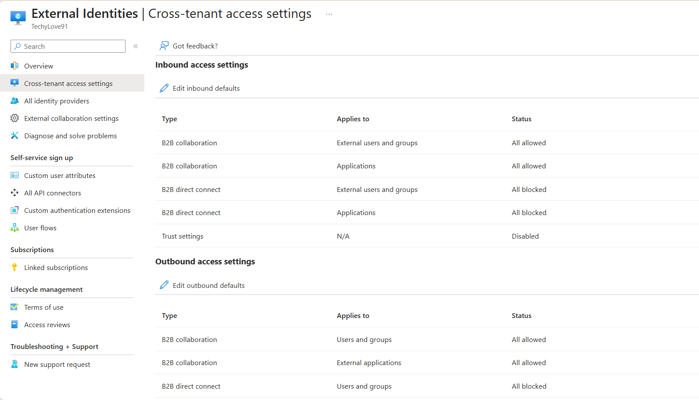
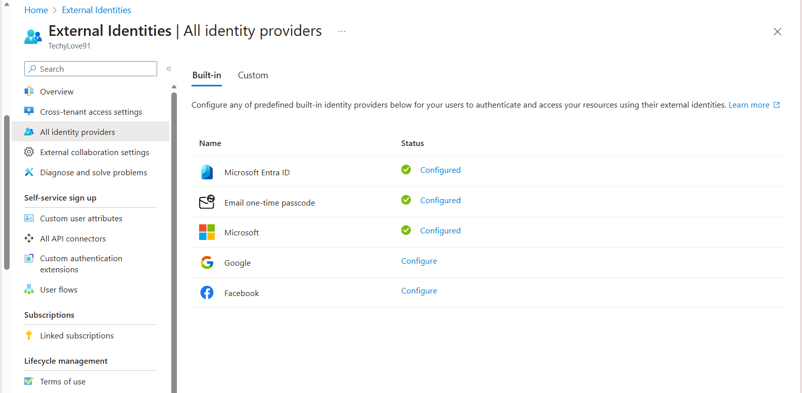

# Lab 04 — External Identity & Cross-Tenant Access Configuration

## Overview
This lab demonstrates hands-on experience configuring external identity collaboration and cross-tenant access controls in Microsoft Entra ID. The scenario focused on managing B2B collaboration settings, inviting and managing external users, and reviewing cross-tenant access and synchronization configurations.

---

## Scenario 1 — External Collaboration Configuration

In this scenario, external collaboration settings were reviewed and evaluated to understand guest access scope, invitation permissions, and identity boundary controls.

---

## Scenario 2 — External User (B2B) Invitation & Management

An external user was invited to the tenant to simulate partner access onboarding. The guest account was validated and reviewed for correct identity type and properties.

---

## Scenario 3 — Cross-Tenant Access Settings

Cross-tenant access settings were reviewed to evaluate inbound and outbound trust boundaries and access policies between tenants.

---

## Scenario 4 — Cross-Tenant Synchronization Review

Cross-tenant synchronization options were reviewed to understand identity lifecycle integration across multiple tenants.

---

## Scenario 5 — External Identity Providers Review

External identity provider configuration options were reviewed, including federation protocols such as SAML and WS-Federation.

---

## Skills Demonstrated
- External identity and B2B collaboration management  
- Guest user lifecycle awareness  
- Cross-tenant access policy understanding  
- Multi-tenant identity architecture concepts  
- Federation and identity provider awareness  

---

## Why This Matters
External identities represent one of the highest risk areas in modern environments. This lab demonstrates foundational skills required to securely manage partner access, enforce Zero Trust principles, and maintain strong identity boundaries across organizational tenants.
