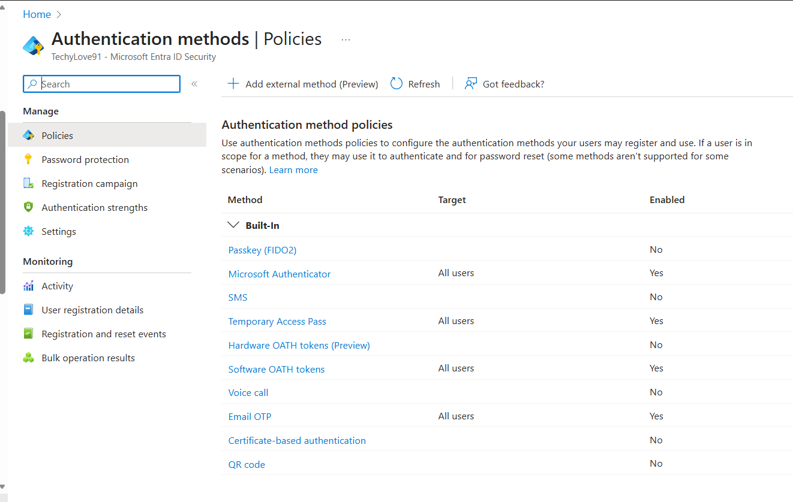
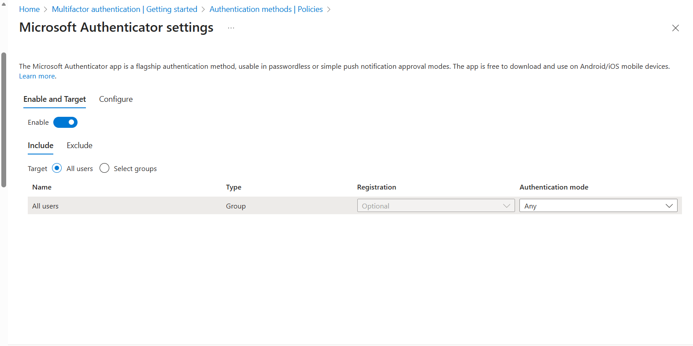
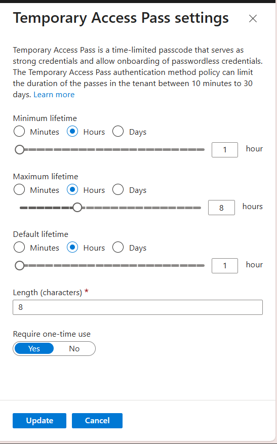
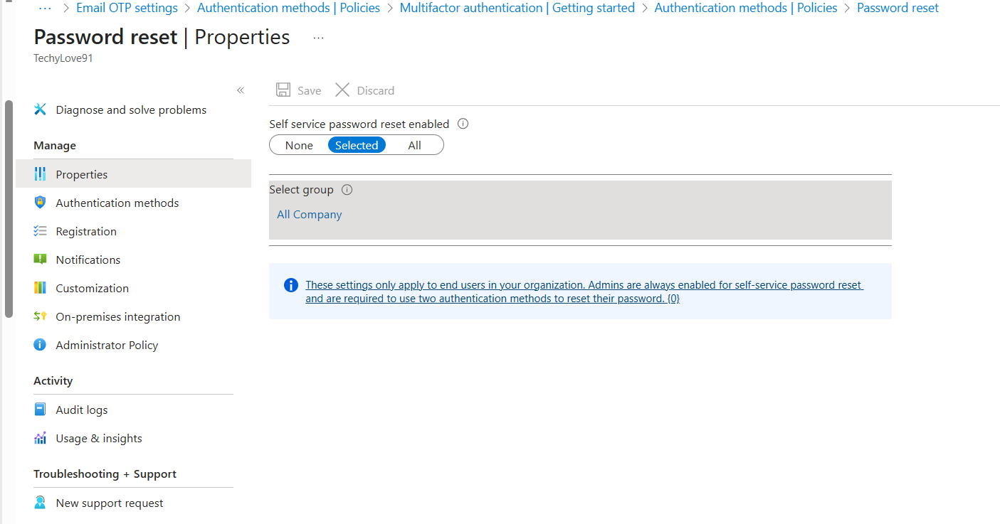
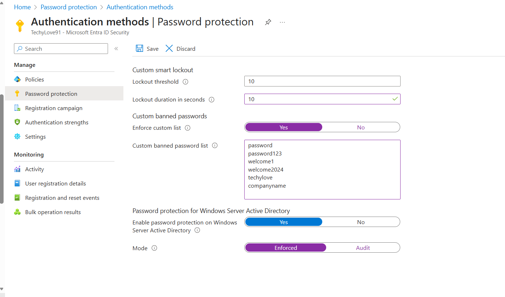

# Lab 05: Authentication, MFA, SSPR & Password Protection

## 🔐 Overview

This lab implements **modern authentication capabilities** in Microsoft Entra ID using **Authentication Methods policies**, enables **Self-Service Password Reset (SSPR)**, and configures **Microsoft Entra Password Protection**.
MFA is prepared here and **enforced via Conditional Access in Lab 06**, aligning with Microsoft Zero Trust guidance.

---

## 🎯 Objectives

* Review and configure Authentication Methods (modern replacement for legacy per-user MFA)
* Enable Microsoft Authenticator, Temporary Access Pass (TAP), and Email OTP
* Deploy Self-Service Password Reset (SSPR)
* Implement Microsoft Entra Password Protection
* Validate configurations prior to Conditional Access enforcement

---

## 🛠️ Technologies Used

* Microsoft Entra ID
* Authentication Methods Policies
* Microsoft Authenticator
* Temporary Access Pass (TAP)
* Self-Service Password Reset (SSPR)
* Microsoft Entra Password Protection

---

## 📋 Prerequisites

* Microsoft Entra ID tenant
* Global Administrator role
* Two test user accounts
* Microsoft Authenticator app

---

## 🧪 Task 1: Review Authentication Methods (Modern)

Navigate to **Protection → Authentication methods → Policies** and review enabled methods.

📸 **Authentication Methods Overview**

```markdown

```

---

## 🧪 Task 2: Configure Authentication Methods Policies

Enable and scope the following to all users (or a test group):

* Microsoft Authenticator (Default)
* Temporary Access Pass (TAP)
* Email OTP

📸 **Microsoft Authenticator**

```markdown

```

📸 **Temporary Access Pass**

```markdown

```

---

## 🧪 Task 3: Configure Self-Service Password Reset (SSPR)

Configured Self-Service Password Reset using the modern Microsoft Entra converged policy model.  
Authentication methods for SSPR are managed through **Authentication Methods policies**, as legacy SSPR authentication settings have been deprecated.

### Actions Performed
- Enabled Self-Service Password Reset for selected users (test scope)
- Required two authentication methods for password reset
- Confirmed Microsoft Authenticator and Email OTP are enabled via Authentication Methods policies

📸 **SSPR Enabled**
```markdown


---

## 🧪 Task 4: Configure Microsoft Entra Password Protection

Enable **Enforced** mode, configure custom banned passwords, and smart lockout.

📸 **Password Protection**

```markdown

```

---

## 🧪 Task 5: Validation & Testing

Validate:

* Authenticator registration / MFA prompt
* SSPR flow
* Weak password rejection
* TAP onboarding
  *MFA enforcement is completed in Lab 06 via Conditional Access.*

📸 **Validation**

```markdown

```

---

## ✅ Results & Outcomes

* Modern authentication methods configured and scoped
* Self-service password reset enabled
* Password protection enforced
* Environment prepared for Conditional Access MFA enforcement

---

## 🚀 Next Steps

* **Lab 06: Conditional Access – Enforce MFA & Restrict Legacy Authentication**
