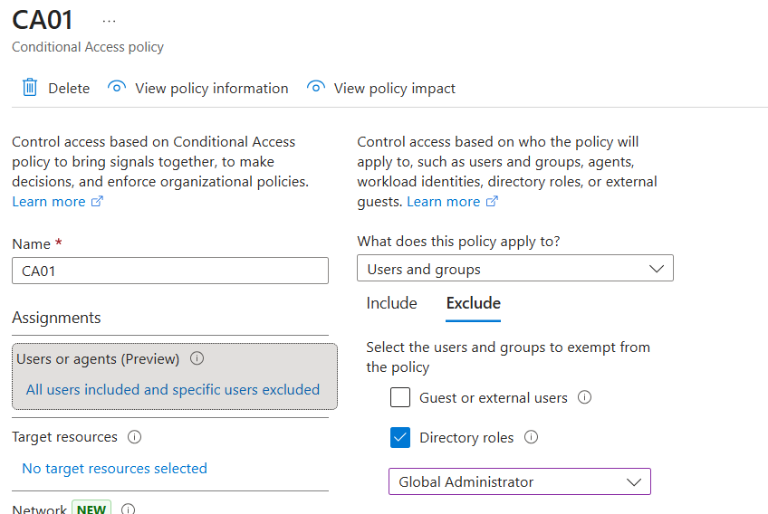
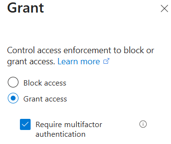
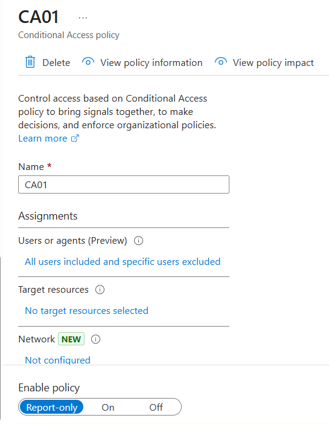
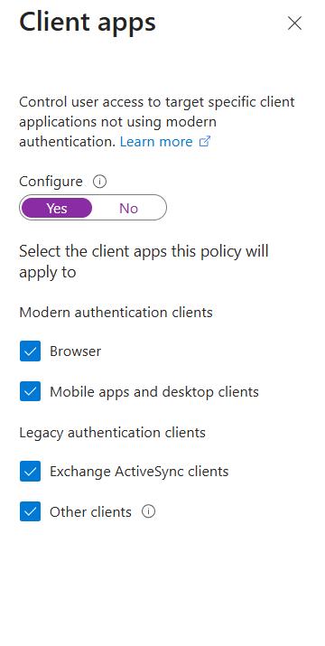
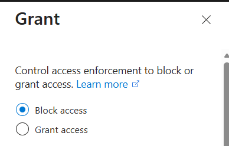
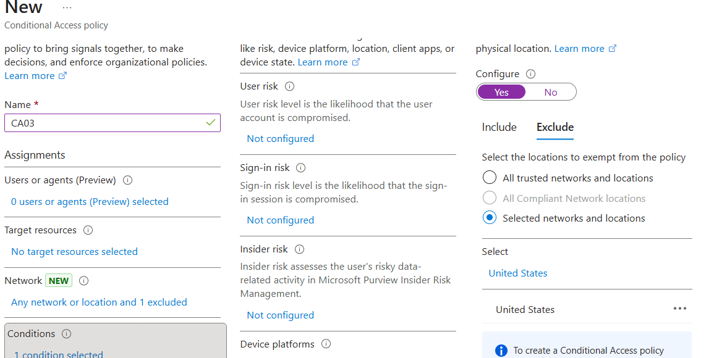
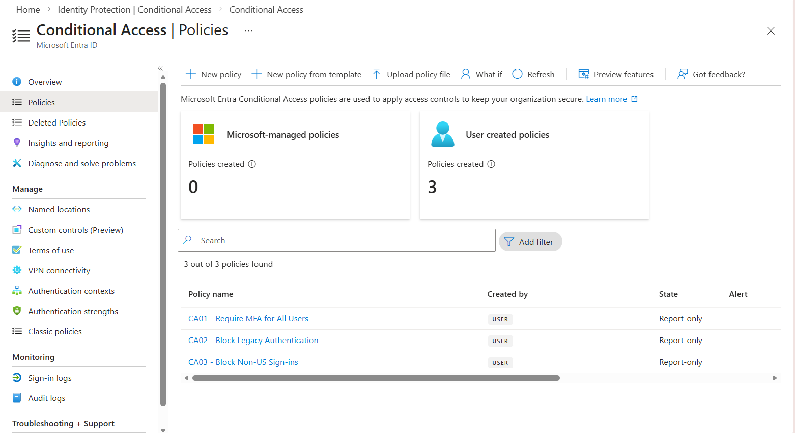
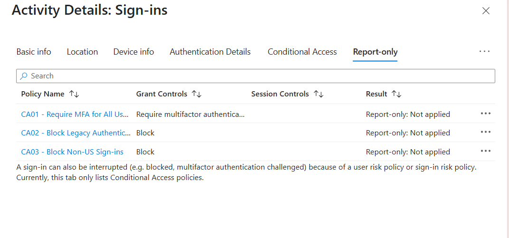

> ⚠️ This lab simulates enterprise Conditional Access implementation using Microsoft Entra ID aligned with Zero Trust security principles.
>
> # 🔐 Lab 06: Conditional Access (Zero Trust)

## 💼 Overview

This lab demonstrates the implementation of **Conditional Access policies** in Microsoft Entra ID to enforce **Zero Trust security principles**.

Policies were configured to:
- Require Multi-Factor Authentication (MFA)
- Block legacy authentication
- Restrict sign-ins based on geographic location

All policies were deployed in **Report-only mode** to safely evaluate their impact without disrupting user access.

---

## 🎯 Objectives

- Implement Conditional Access policies for identity protection
- Enforce MFA using policy-based controls
- Block legacy authentication protocols
- Apply location-based access restrictions
- Analyze policy impact using sign-in logs and report-only results

---

## 🛠️ Technologies Used

- Microsoft Entra ID (Azure AD)
- Conditional Access Policies
- Multi-Factor Authentication (MFA)
- Named Locations
- Sign-in Logs & Monitoring

---

## 📋 Prerequisites

- Microsoft Entra ID P2 license
- Global Administrator role
- Test user account
- Configured Authentication Methods (Lab 05)

---

## 🧪 Policy 1: Require MFA for All Users

### Configuration
- Users: All users  
- Exclusion: Admin account (to prevent lockout)  
- Cloud apps: All cloud applications  
- Grant control: Require multi-factor authentication  
- Mode: Report-only  

### 📸 Admin Exclusion

### 📸 MFA Grant Control

### 📸 Report-Only Mode

---

## 🧪 Policy 2: Block Legacy Authentication

### Configuration
- Users: All users  
- Exclusion: Admin account  
- Cloud apps: All cloud applications  
- Client apps: Browser, Mobile & Desktop, **Other clients (legacy)**  
- Access: Block  
- Mode: Report-only  

### 📸 Client Apps Configuration

### 📸 Block Access Control

---

## 🧪 Policy 3: Block Non-US Sign-ins

### Configuration
- Users: All users  
- Exclusion: Admin account  
- Cloud apps: All cloud applications  
- Locations:
  - Include: Any location  
  - Exclude: United States  
- Access: Block  
- Mode: Report-only  

### 📸 Location Restriction

---

## 📊 Policy Overview

### 📸 Conditional Access Policies

---

## 🧪 Validation & Monitoring

Sign-in logs were used to evaluate policy behavior in **Report-only mode**.

### 📸 Report-Only Results

---

## 🔐 Security Insights

- Conditional Access enables **policy-driven security enforcement** based on identity signals  
- Report-only mode allows safe testing before enforcement  
- Blocking legacy authentication prevents bypass of modern security controls like MFA  
- Location-based policies reduce risk from unauthorized geographic access  
- Excluding administrative accounts prevents accidental lockout during testing  

---

## 🚀 Key Takeaways

- Successfully implemented Conditional Access policies aligned with **Zero Trust architecture**
- Enforced strong authentication requirements using MFA
- Mitigated legacy authentication risks
- Applied geographic access controls
- Validated security posture using real sign-in telemetry

---

## ➡️ Next Steps

**Lab 07: Identity Governance OR PowerShell User Lifecycle Automation**
